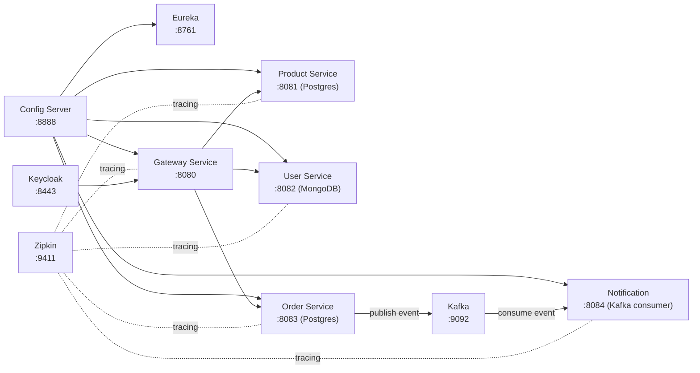

# ecom-microservices

[](https://www.oracle.com/java/)
[](https://spring.io/projects/spring-boot)
[](https://spring.io/projects/spring-cloud)
[](https://maven.apache.org/)
[](https://www.docker.com/)

Microservices e-commerce dengan Spring Boot + Spring Cloud (Config Server, Eureka, Gateway), multi database (Postgres + MongoDB), event-driven notification (Kafka), dan tracing (Zipkin).

## (Quick Start)

1) Start infra (Postgres, Mongo, Kafka, Keycloak, Zipkin):
```bash
cd deploy/docker
docker compose up -d
```

2) Jalankan service (rekomendasi urutan):
```bash
cd configserver && mvn spring-boot:run
cd eureka && mvn spring-boot:run
cd gateway && mvn spring-boot:run
cd product && mvn spring-boot:run
cd user && mvn spring-boot:run
cd order && mvn spring-boot:run
cd notification && mvn spring-boot:run
```

## Arsitektur Singkat



## Modul

| Modul | App Name | Port | Catatan |
|---|---|---:|---|
| `configserver` | configserver | 8888 | Config source: `configserver/src/main/resources/config` |
| `eureka` | eureka | 8761 | Service discovery |
| `gateway` | gateway-service | 8080 | OAuth2 Resource Server (issuer Keycloak) |
| `product` | product-service | 8081 | Postgres (`productdb`) |
| `user` | user-service | 8082 | MongoDB (`userdb`) |
| `order` | order-service | 8083 | Postgres (`orderdb`), Kafka producer |
| `notification` | notification | 8084 | Kafka consumer |

## Infra (Docker Compose)

File: `deploy/docker/docker-compose.yml`

Infra yang disediakan:
- Postgres: `localhost:5433` (compose expose `5433:5432`)
- pgAdmin: http://localhost:5050
- Keycloak: http://localhost:8443
- MongoDB: `localhost:27017`
- Kafka: `localhost:9092` + Zookeeper: `localhost:2181`
- Zipkin: http://localhost:9411

Start/Stop:
```bash
cd deploy/docker
docker compose up -d
docker compose down
```

## Prerequisites

- Java 21
- Maven
- Docker + Docker Compose

## Konfigurasi (Default)

Konfigurasi service di-load dari Config Server (native config):
- `configserver/src/main/resources/config/*.yaml`

Gateway JWT issuer (Keycloak realm):
- `issuer-uri`: `http://localhost:8443/realms/ecom-app`

Database:
- Product Service → `jdbc:postgresql://localhost:5433/productdb`
- Order Service → `jdbc:postgresql://localhost:5433/orderdb`
- User Service → `MONGO_URI` (contoh untuk local: `mongodb://localhost:27017/userdb`)

Environment variables:
- `DB_USER`, `DB_PASSWORD`
- `MONGO_URI`
- `ZIPKIN_URL` (default: `http://localhost:9411/api/v2/spans`)

## URL

- Gateway: http://localhost:8080
- Eureka: http://localhost:8761
- Config Server: http://localhost:8888
- Zipkin: http://localhost:9411
- Keycloak: http://localhost:8443
- pgAdmin: http://localhost:5050

## Contoh Request API (template)

Catatan: Sebagai contoh “siap pakai” untuk ngetes flow + auth.

### 1) Ambil Access Token dari Keycloak (password grant)

> Pastikan realm/client/user sudah dibuat di Keycloak. Default compose hanya bootstrap admin (`admin/admin`).

```bash
curl -s -X POST "http://localhost:8443/realms/ecom-app/protocol/openid-connect/token" \
  -H "Content-Type: application/x-www-form-urlencoded" \
  -d "grant_type=password" \
  -d "client_id=<your-client-id>" \
  -d "username=<your-username>" \
  -d "password=<your-password>"
```

Simpan token ke env var:
```bash
export TOKEN="<access_token_here>"
```

### 2) Hit Gateway (contoh secured endpoint)

```bash
curl -i "http://localhost:8080/<your-api-path>" \
  -H "Authorization: Bearer $TOKEN"
```

### 3) Contoh payload (Product / Order)

Create product (contoh):
```bash
curl -s -X POST "http://localhost:8080/api/products" \
  -H "Authorization: Bearer $TOKEN" \
  -H "Content-Type: application/json" \
  -d '{
    "name": "Keyboard Mechanical",
    "price": 499000,
    "stock": 10
  }'
```

Create order (contoh):
```bash
curl -s -X POST "http://localhost:8080/api/orders" \
  -H "Authorization: Bearer $TOKEN" \
  -H "Content-Type: application/json" \
  -d '{
    "userId": "USER_123",
    "items": [
      { "productId": "PROD_1", "qty": 1 }
    ]
  }'
```

Jika `order-service` publish event ke Kafka dan `notification` subscribe, bisa lihat log `notification` untuk memastikan event terbaca.

## Notes / TODO

- `deploy/docker/docker-compose.yml` dicomment beberapa service app (gateway/user/order/product). bisa:
  - jalankan app via `mvn spring-boot:run` (recommended untuk dev), atau
  - uncomment bagian service kalau mau full dockerized stack.
